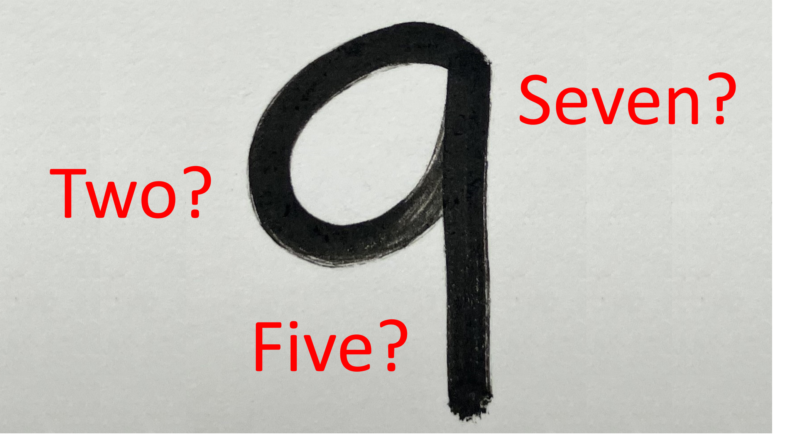

# A machine learning model to recognize handwritten digits

This is a small practice tutorial for a machine learning model that recognizes handwritten digits. The tutorial is inspired by Andrew Ng's lectures of machine learning algorithms on Coursera, with additional code for image pre-processing of handwritten digits based on the work of Ole Kröger. https://github.com/opensourcesblog/tensorflow-mnist/blob/master/mnist.py 